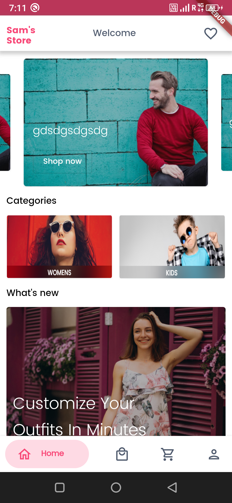
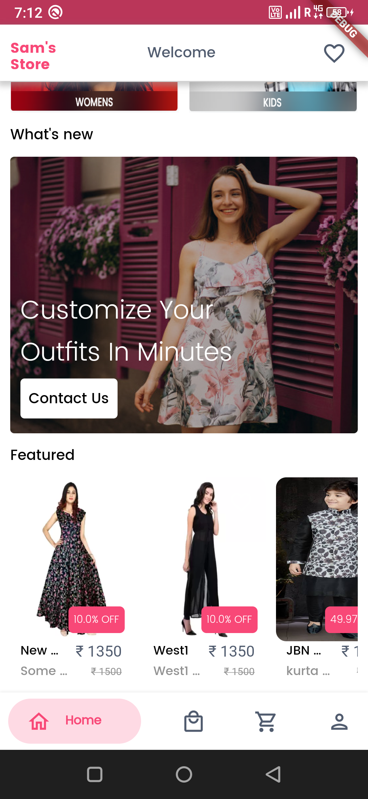
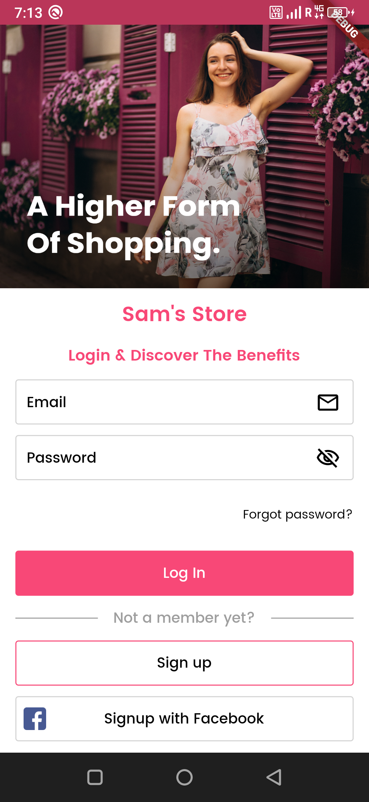
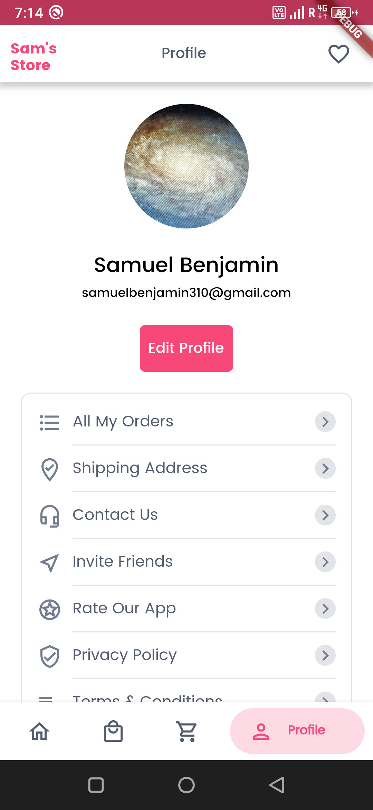
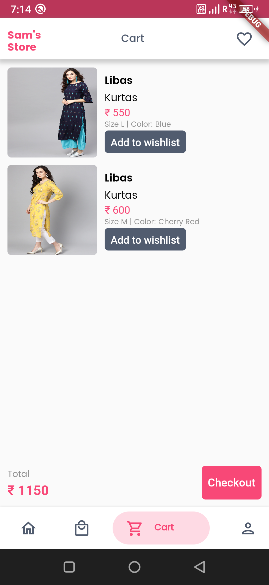
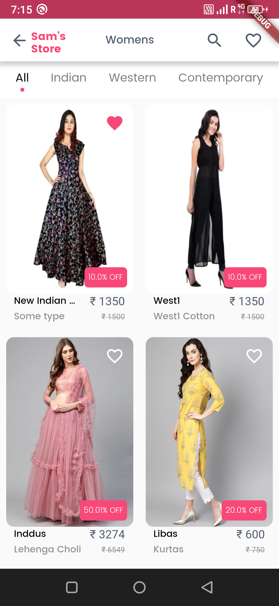
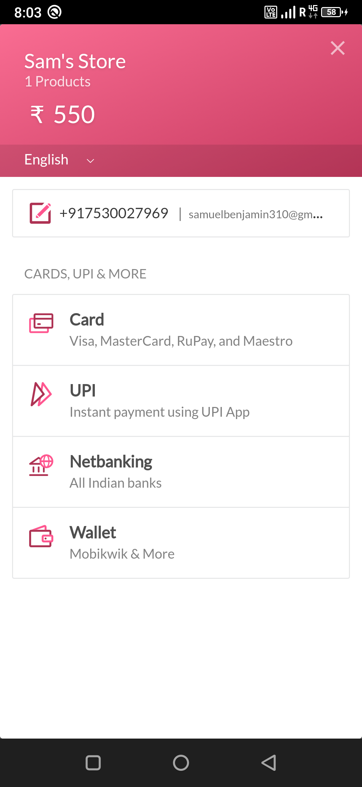
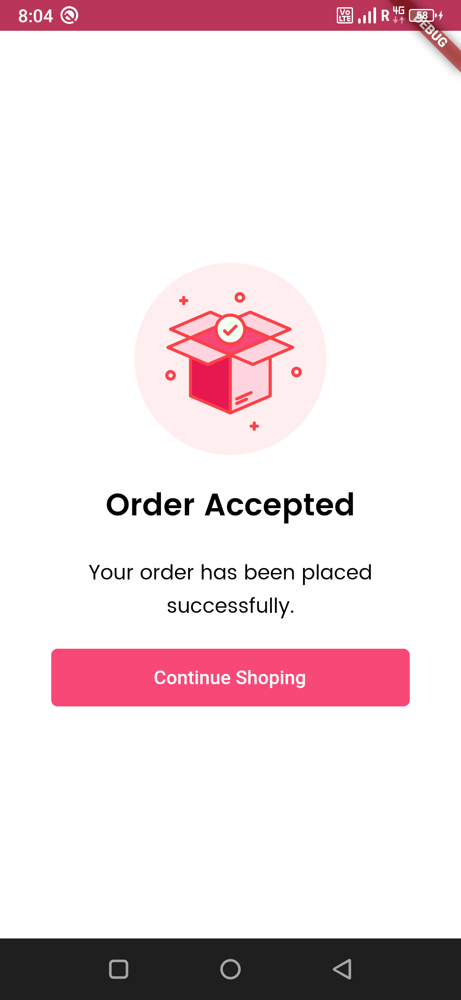
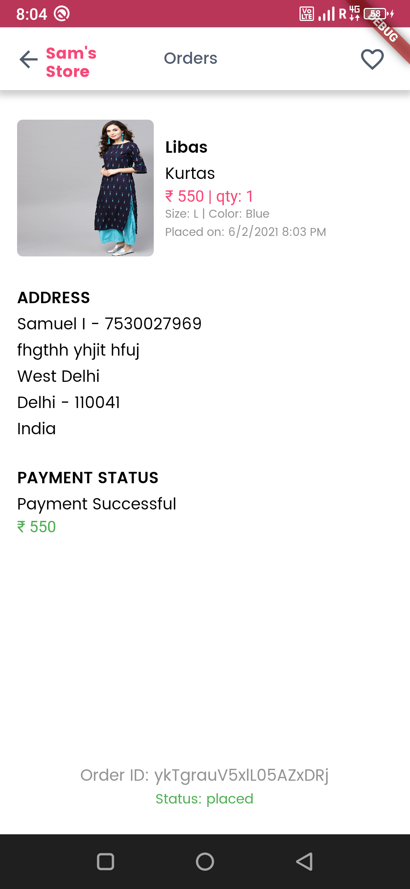

# Sam's Online Shopping App Demo

A boutique shop app, where the customer can buy desired fashionable clothes which are uploaded and managed by the admin.

Admin and customer have separarte apps.

 - [Admin App](https://flutter.dev/docs/get-started/codelab)
 - [Customer App](https://flutter.dev/docs/get-started/codelab)

This app is made to demonstrate the usage of,

- Firebase authentication (for user authentication)
- Firebase firestore (for storing all the data)
- Firebase messaging (for sending push notification)
- Firebase storage (for storing images)
- Razorpay payment gateway integration (for online payment)

## Images

<div>



</div>

<div>



</div>

<div>



</div>

<div>



</div>

<div>

</div>

## How to run

1. Create firebase project
2. Enable authentication using email and password in firebase platform
3. Download google-services.json to obtain your Firebase Android config file (google-services.json)
4. Move your config file into the android/app directory of your Flutter app.

5.  Run following cmd to get flutter packages
    ```
    $ flutter pub get
    ```

6.  To run the app in your android or ios device, run the following command.
    ```
    $ flutter run
    ```


